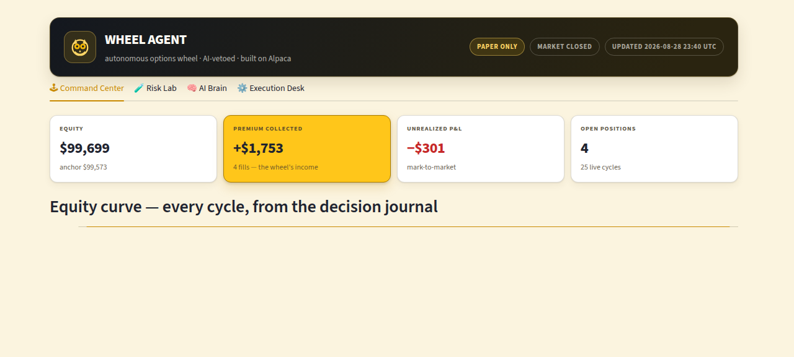

# 🦉 Wheel Agent — the autonomous options wheel whose AI can only say NO



An autonomous options-wheel trading agent built for the **Alpaca AI Trading
Agents Hackathon 2026** (lablab.ai × Alpaca). It sells cash-secured puts on
liquid US names, takes profit or rolls for credit, sells covered calls if
assigned, and repeats — while a Claude layer watches the market and can veto
any new entry. **Paper trading only.**

**The twist:** the AI never places, sizes, or forces a trade. It reads the
market regime and it can refuse. A deterministic engine on hard-coded rails
does the trading; the LLM is the risk governor. Every decision — including
Claude's verbatim reasoning and every bug found and fixed live — is journaled
and shown on the dashboard.

## How one cycle works

1. **Observe** — account, positions, open orders (broker is the source of truth), SPY/QQQ trend + volatility context
2. **Gate** — kill-switch, daily drawdown stop, then TWO regime readers: Claude's judgment *and* a deterministic SPY-intraday anchor — the tighter of the two governs budget and entries
3. **Decide** — per underlying: new CSP (Δ≈0.30, DTE 7–35, OI ≥ 200, spread ≤ 15%, vol-percentile ≥ 40th of its own history), take-profit at 50% of credit, roll *only* for net credit, covered calls must clear cost basis **and** the upper Bollinger band
4. **Veto** — Claude reviews every proposed entry; a veto with a stated reason kills it
5. **Execute** — marketable limit orders (never market), exits before entries, dedupe by client-order-id, stale entries auto-re-priced (20 min, chase-capped)
6. **Journal** — everything appended to a JSONL decision log that feeds the dashboard

## Dashboard (read-only, zero credentials)

`streamlit run agent/dashboard/app.py` — or the hosted copy (link added at
submission). Four tabs:

- **Command Center** — equity curve from the decision journal, premium collected, the wheel stage per underlying, both regime readers side by side
- **Risk Lab** — positions with collateral, per-underlying/per-sector caps, a live **stress test** (what a −1/−2/−5% night does to the book), and the full list of hard-coded safety rails
- **AI Brain** — Claude's actual words each cycle, every veto, and the deterministic decision feed
- **Execution Desk** — fills, open orders, re-prices, kill-switch status

The dashboard is fed by `dashboard/data.json`, snapshotted from the paper
account by the agent each cycle. No API key ever leaves the trading machine.

## Night 1 (Aug 28, first market session)

4 fills, **$1,753 premium collected**, 25 autonomous live cycles, 2 real bugs
found by the agent's own journaling and fixed the same night (a py3.10 enum
stringification quirk that blinded position detection, and a budget that
ignored open orders). Full story in the commit history and
[docs/RESEARCH_NOTES.md](docs/RESEARCH_NOTES.md) — the strategy is validated
against Alpaca's official wheel guide, peer-reviewed volatility research
(Rustamov et al. 2024, inverted for premium selling), practitioner consensus,
and a production-grade open agent system; every adoption and rejection is
written down. For judges in a hurry: **[one-page write-up](docs/WRITEUP.md)**
(AI logic, risk gates, Alpaca infra) ·
**[business case](docs/BUSINESS_CASE.md)** (TAM/SAM, competitors, revenue).

## Architecture

```
agent/src/agent/
  config.py         temperament knobs + risk gates (paper-only hard-coded)
  alpaca_client.py  thin wrapper: trading + option/stock data, OCC parsing
  risk.py           kill-switch, drawdown stop, earnings blackout, sector map,
                    deterministic regime tiers
  wheel.py          the state machine: CSP → assignment → covered call
  ai.py             Claude headless (claude -p): regime read + entry veto
  cycle.py          orchestration, cap enforcement, stale re-pricing
  journal.py        append-only JSONL decision journal + state
  export.py         dashboard data snapshot (zero credentials)
  main.py           CLI: status | cycle [--live] | loop | cancel-orders
```

Built on all three Alpaca surfaces: **Trading API** (alpaca-py SDK — the
engine), **CLI** (operations & monitoring), and **MCP server** (connected to
the Claude session that built and supervises the agent).

## Safety rails (not dashboard decorations)

| Rail | Value |
|---|---|
| Account | paper-only, hard-coded; live endpoint not resolvable from this machine |
| Per-underlying collateral | ≤ 18% of equity |
| Total collateral | ≤ 72% (halved in weak AI regime, halved in BEAR anchor, zero in EXTREME) |
| Diversification | ≤ 5 underlyings, ≤ 2 per correlated sector |
| Entry quality | Δ 0.18–0.42 band, OI ≥ 200, spread ≤ 15%, vol percentile ≥ 40% |
| Exits | 50% take-profit; roll only for net credit; never panic-buy-back |
| Daily drawdown stop | no new entries past −3% on the day |
| Kill switch | `agent/KILL` file halts all submissions |
| Default mode | dry-run; orders only with explicit `--live` |

## Quick start (last, on purpose)

```bash
cd agent
uv sync
cp ../.env.example .env      # fill PAPER API keys (never commit)
uv run wheel-agent cycle     # dry-run by default
uv run wheel-agent cycle --live   # submit to the PAPER account
uv run wheel-agent loop --live --interval 900
```

## Disclaimers

Educational hackathon build. Paper trading only — no real money, no
performance guarantee, not investment advice. Options involve substantial
risk of loss. Leveraged/derivative instruments can lose value rapidly
including total loss. Unaffiliated with Robinhood/Alpaca beyond using their
public APIs.
